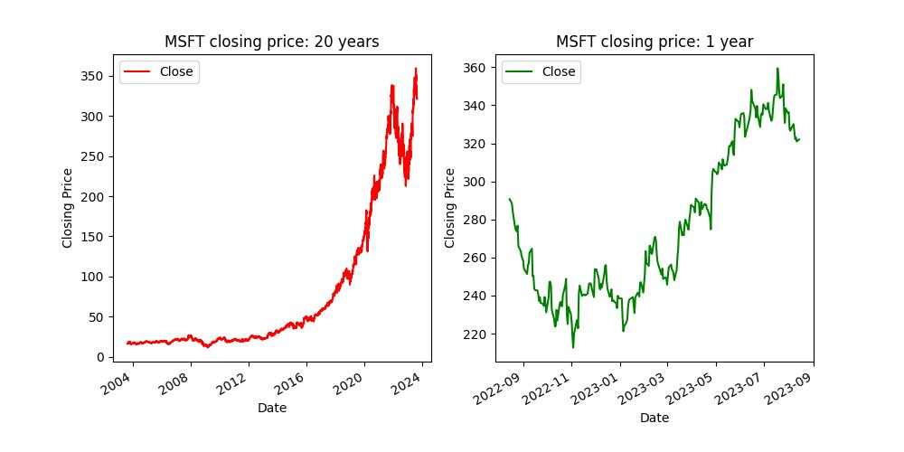

# StockPricePredictor

My interst in Quantitative Finance led me to making a stock price predictor using two Machine Learning Models:
    <ul>1. Random Forest Model -> random_forest_model.ipynb</ul>
    <ul>2. Recurren Neural Network -> rnn.ipynb</ul>

The project utilizes live data from the Yahoo Finance Python library: yfinance. Other libraries used during the project include Pandas, Numpy, sklearn, matplotlib and Tensorflow.

## Random Forest Model

 The model is used to predict whether the stock price will go up or down the following day. The model does not predict the new price, but instead only predicts the trend. The reason to do this is pretty simple: swing traders who are new to trading do not need to know the price of the stock tomorrow, they just need to know whether the stock price will go up or down. This model helps them do exactly that.

### How the code works

The code can be explained using the following steps: 
    <ol>
    1. The user is allowed to give an input, which would be ticker of the stock they want to predict for.  
    2. Simple plots are generated showing the variance of the stock price over a long period (20 years) and over a shorter period (1 year). The plots can be seen below:  
    </ol>

    

    <ol>
    3. A new column called 'Tomorrow' is added to the dataframe, which contains the closing price of the stock from the previous day. The reason to do this, instead of simply using the opening price is to avoid any external factors in the time between the closing and opening bell to affect the prediction. Thus the prediction made is purely off the price trend, and nothing in the interim between the closing and opening times. 
    4. Another column called 'Target' is added to the dataframe, which tells us whether the price at the opening bell tomorrow, is greater than the price at the closing bell the previous day. Of course, all the values in this column start of as False. This column will eventually be populated to indicate the upward or downward trend of the stock price. 
    5. The dataset is then split into training and testing data. Taking an arbitrary value of 3000 datapoints for the training data, and the rest of the datapoints for testing. 
    6. A list of features is created, of which we will train our data. These include: Closing Price, Volume, Opening Price, High and Low. 
    7. The Random Forest Model is made with the following parameters:
            <ol>
            i. n_estimators = 100: This represents the number of decision trees that we want to use during the training of our data. Usually the more trees we use, the more accurate our results would be. 
            ii. min_sample_split = 100: This value helps protect the model from being overfit. It may lead to less accurate results, however helps prevent the risk of overfitting. 
            iii. random_state = 1: This number represents the number of random seeds that we want to use to randomize our forest. 
            </ol>
    8. The model is then fit and trained using the training dataset.
    9. The model is then fed the testing data, in order to obtain predictions.
    </ol>
    From initial fitting and training, the model has a precision score of 0.55172.

### Backtesting System

The goal of any backtesting system is use historical market data to evaluate how the stratergy would have performed in the past. It helps gain insight on profitability, risk and effectiveness of the stratergy.
A backtesting system has been created to help improve the performance of the model. The model allows us to take every 2500 datapoints to predict the nbext 250 datapoints. So we are basically using 2500 days of data to predict the price for the next 250 days. 
The system consists of two functions: prediction function and backtesting function.
The backtest function splits the data into training and testing data and then calls the prediction function. The prediction function takes in the input trianing data, and predictor columns, fits the data to the model that is created, and the returns the predictions that the model made, along with the actual value that correspond to those predictions.
When doing this, we had a precision score of: 0.53237.
Also go ahead to calculate the number of days the index value goes up, and the number of days it is predicted to go down. It to predicted to go up 59% of the 250 days, and down on 41% of days of the 250.
The idea of the backtesting is to trying create a more accurate model, which would happen if you change the paramters of the input. FOr instance, increasing the start value, which is the number of days we want to take as training data would lead to a more accurate representation of the true data. 

